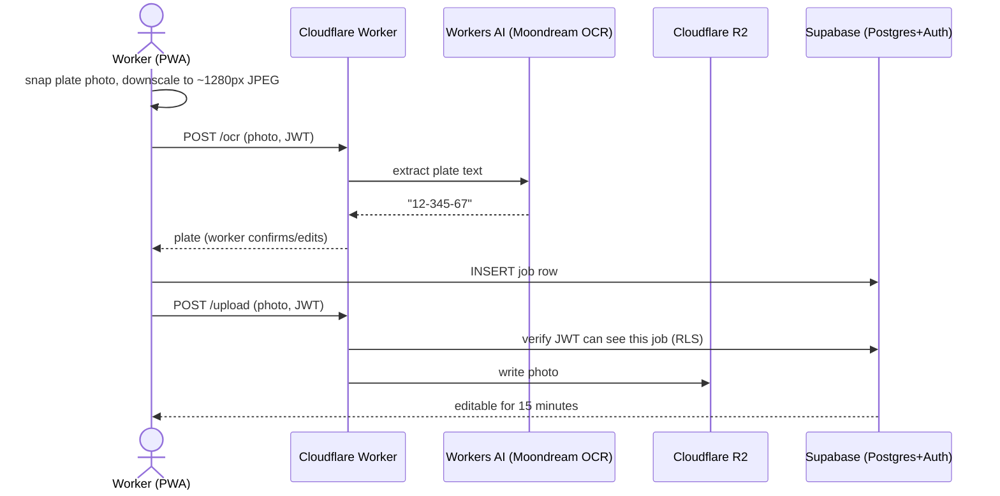

# Vehicle Prep Job Tracker

Replaces a WhatsApp-photo + manual-Excel workflow for a 3-site car
detailing/prep business. A worker photographs a vehicle's plate and VIN, OCR
autofills both fields, they tap the services performed, and submit — no more
double data entry. Managers get a per-site dashboard, billing-code entry,
photo access, and one-click Excel export. Each worker can see their own job
counts by month, and admins get a site-and-month analytics view (jobs by
month/worker/service) plus a unique catalog number per service.

Full requirements and architecture rationale: see the design doc this repo
was built from (business analysis, technology trade-offs, data model,
security model, cost breakdown).

**Target cost: $0/month**, using free tiers throughout (Supabase, Cloudflare
Pages/Workers/R2/Workers AI, GitHub Actions).

## Architecture



- **`web/`** — React + Vite PWA. All UI (worker submission, manager
  dashboard, admin). Talks directly to Supabase for data, and to the Worker
  only for OCR and photos.
- **`worker/`** — Cloudflare Worker. The only custom backend: OCR (runs on
  Cloudflare's own Workers AI, no external vendor or API key) and photo
  read/write (keeps the R2 bucket private, authorized via the caller's own
  Supabase JWT).
- **`supabase/migrations/`** — schema, Row Level Security policies, seed data.

Authorization lives almost entirely in Postgres RLS — both the frontend and
the Worker are thin, and neither reimplements "who can see this job."

Analytics (My Stats, Admin Analytics) are read from `job_monthly_stats` and
`job_service_stats` — plain Postgres views with `security_invoker = true`, so
they inherit the exact same RLS as the `jobs` table rather than needing a
separate authorization story. Aggregation happens in Postgres, not by
shipping raw job rows to the browser and summing in JS.

The UI is mobile-first for workers and managers (bottom tab bar, narrow
single-column screens) but switches to a persistent sidebar and wider
containers on `md:`+ screens, since admins mainly use this on desktop — see
`web/src/components/Layout.tsx`.

## First-time setup

1. **Supabase**: create a project, run every file in `supabase/migrations/`
   **in order** (SQL Editor, one at a time, or `supabase db push`), then in
   Studio: create your sites and the first admin user (Authentication ->
   invite by email, then Table Editor -> `users` -> insert a row with
   `role = 'admin'` and that account's `auth_id`). After that, use the
   in-app Admin screens for everyone else, including assigning each
   service's catalog number.
2. **Cloudflare Worker**: see [`worker/README.md`](worker/README.md).
3. **Web app**:
   ```bash
   cd web
   cp .env.example .env.local   # fill in Supabase URL/key + Worker URL
   npm install
   npm run dev
   ```
4. **Frontend deploy**: the app deploys as a Workers static-assets project
   (`koch-cars-report`) via `web/wrangler.toml` — pushes to `main` deploy it
   through `.github/workflows/deploy-web.yml`, or deploy manually:
   ```bash
   cd web && npm run build && npx wrangler deploy
   ```
5. **GitHub Actions secrets** (repo Settings -> Secrets and variables ->
   Actions): `CLOUDFLARE_API_TOKEN`, `CLOUDFLARE_ACCOUNT_ID`,
   `SUPABASE_DB_URL` (nightly backups — Supabase Project Settings ->
   Database -> Connection string, "session" mode), plus the frontend
   build vars `VITE_SUPABASE_URL`, `VITE_SUPABASE_ANON_KEY`,
   `VITE_WORKER_URL` (same values as `web/.env.local`).
6. **Supabase Auth settings** (both required for invite-only registration):
   turn OFF "Allow new users to sign up" (Authentication -> Sign In / Up),
   and add `<your app URL>/welcome` to Authentication -> URL Configuration
   -> Redirect URLs.

## Monitoring

- **Uptime**: point [UptimeRobot](https://uptimerobot.com) (free) at the
  Worker's `/health` endpoint and the Pages URL.
- **Frontend errors**: add a free [Sentry](https://sentry.io) project and
  drop its DSN into `web/src/main.tsx` when you're ready for it — not wired
  in yet, since it wasn't needed to validate the pilot.

## Pilot rollout

Run this at the 2-worker site for about a week alongside the existing
WhatsApp process before switching the two larger sites over. Watch for: OCR
accuracy on your actual plates/VINs, whether the 15-minute edit window is
long enough, and whether the service list needs adjusting.

## Repo layout

```
supabase/migrations/   Postgres schema + RLS (source of truth for data model)
worker/                Cloudflare Worker (OCR proxy, photo storage)
web/                   React PWA (worker + manager + admin UI)
.github/workflows/     CI, Worker deploy, nightly DB backup
```
